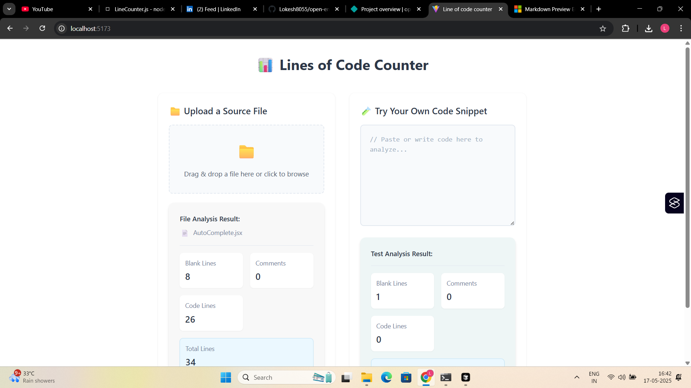

# Open Envoy (Line of Code Counter) Solution

<div align="center">


A modern React application that provides an efficient way to count lines of code in files and directories, with a clean and intuitive user interface.

[Live Demo](https://open-envoy-lp.netlify.app/) • [Source Code](https://github.com/Lokesh8055/open-envoy-code-solution)

</div>

## 📋 Table of Contents

- [Features](#-features)
- [Getting Started](#-getting-started)
- [Usage](#-usage)
- [Technical Details](#-technical-details)
- [Development Process](#-development-process)
- [Screenshots](#-screenshots)
- [Technologies Used](#-technologies-used)
- [Learning Outcomes](#-learning-outcomes)
- [Author](#-author)

## ✨ Features

### Core Functionality
- 📊 **Line Counting Analysis**
  - Total line count
  - Code line count
  - Comment line count
  - Blank line count
  - File type distribution

### User Interface
- 🎯 **Intuitive Design**
  - Clean, modern interface
  - Real-time analysis
  - Visual feedback
  - Responsive layout

### Advanced Features
- 📁 **File Handling**
  - Drag and drop support
  - Multiple file types
  - Large file optimization
  - Progress indicators

## 🚀 Getting Started

### Prerequisites
- Node.js (v14 or higher)
- npm or yarn

### Installation

1. Clone the repository
```bash
git clone https://github.com/Lokesh8055/open-envoy-code-solution.git
cd open-envoy-code-solution
```

2. Install dependencies
```bash
npm install
```

3. Start the development server
```bash
npm run dev
```

## 💻 Usage

1. **File Analysis**
   - Drag and drop a file or click to browse
   - Supported formats: `.js`, `.jsx`, `.ts`, `.tsx`, `.java`, `.txt`
   - View detailed line count statistics

2. **Code Snippet Analysis**
   - Paste code directly into the text area
   - Get instant analysis results
   - Real-time updates as you type

## 🔧 Technical Details

### Architecture
- React 18+ with functional components
- Custom hooks for line classification
- Efficient file processing algorithms
- Responsive design patterns

### Performance Optimizations
- Lazy loading of components
- Efficient file reading
- Memory usage optimization
- Debounced input handling

## 🛠️ Development Process

1. **Project Setup**
   - Created React project using Vite
   - Set up project structure and dependencies
   - Implemented file system operations
   - Configured development environment

2. **Core Features Development**
   - Built file and directory selection functionality
   - Implemented line counting algorithm
   - Created file type detection system
   - Added recursive directory scanning

3. **UI/UX Implementation**
   - Designed clean and intuitive interface
   - Implemented drag-and-drop functionality
   - Added progress indicators
   - Created responsive layout

4. **Testing & Optimization**
   - Tested with various file types
   - Optimized performance for large directories
   - Added error handling
   - Implemented loading states

## 📱 Screenshots

<div align="center">
  
  
</div>

## 🛠️ Technologies Used

### Frontend Framework
- React 18+
- Vite for build tooling
- Modern JavaScript (ES6+)

### UI/UX
- CSS3 with Flexbox
- Responsive design
- Custom animations
- Drag and drop interface

### Development Tools
- ESLint for code quality
- Git for version control
- Netlify for deployment

## 📚 Learning Outcomes

### File System Operations
- Working with the File System API
- Handling large file operations
- Implementing recursive directory scanning
- Managing file type detection

### Performance Optimization
- Optimizing file reading operations
- Implementing efficient line counting
- Managing memory usage with large files
- Adding progress indicators for long operations

### User Experience
- Creating intuitive file selection interface
- Implementing drag-and-drop functionality
- Adding visual feedback for operations
- Designing responsive layouts

### Error Handling
- Managing file system errors
- Handling unsupported file types
- Implementing graceful fallbacks
- Providing user-friendly error messages

## 👨‍💻 Author

<div align="center">

### Lokesh Padmanabhan

[](https://www.linkedin.com/in/lokesh-padmanabhan/)
</div>

---
